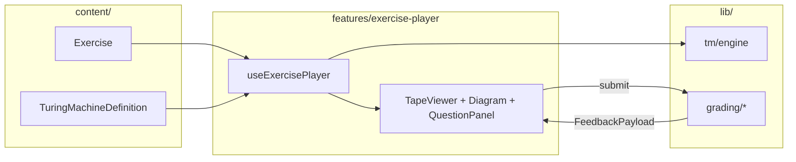

# Component Map and App Flow

This document ties **screens**, **feature components**, and **state** to the curriculum capabilities (tracing, next step, hints, study vs quiz).

---

## 1. Screen map

| Screen | Route (example) | Responsibility |
|--------|-----------------|----------------|
| **Home** | `/` | Course framing, link to catalog, mode toggle (study/quiz), optional “continue”. |
| **Exercise list** | `/exercises` | Filter by tag/difficulty/skill; lists `Exercise` titles from registry. |
| **Exercise player** | `/exercises/:id` | Single exercise: TM visualization + question UI + hints + submit + link to explanation. |
| **Session results** | `/results` | After a quiz batch: score, list attempts, link back to weak tags. |

**Local vs shared state**

| State | Scope | Notes |
|-------|--------|------|
| `sessionMode` | Shared (React context or URL query `?mode=quiz`) | Drives hints, retries, when explanation appears. |
| `exercisePlayer` | Player route | Execution history, selection, submission — can reset on `id` change. |
| `sessionResults` | Quiz flow | Accumulate `PlayerAttempt[]` until user ends session. |
| Registry data | Module scope / static import | `content/index.ts` — no server. |

---

## 2. Component hierarchy

### 2.1 App shell

- **`AppShell`** — layout: header (title, mode badge), main outlet, footer/help.
- **`SessionModeToggle`** — switches `study` | `quiz`; persists to `localStorage` (optional).

### 2.2 Exercise list page

- **`ExerciseListPage`**
  - **`ExerciseFilters`** — difficulty, tag (P1, scan), skill id.
  - **`ExerciseCard`** — title, difficulty, tags; navigates to player.

### 2.3 Exercise player page (core)

- **`ExercisePlayerPage`**
  - Loads `Exercise` + resolves `TuringMachineDefinition` from registry.
  - Orchestrates hooks: `useExercisePlayer(exercise, sessionMode)`.

**Feature subtree `features/exercise-player/`:**

| Component | Role |
|-----------|------|
| **`ExerciseHeader`** | Title, description, difficulty, policy chips (blank display, left-end behavior). |
| **`TapeViewer`** | Renders `TapeModel`; highlights **head** cell; optional scroll window; blank rendering from `blankDisplay`. |
| **`StateDiagramViewer`** | Renders states and transitions; highlights **current state**; optional edge highlight for last fired transition. |
| **`ExecutionControls`** | Step / reset / run-to-halt (respect `maxSteps`); disabled in quiz if policy forbids. |
| **`QuestionPanel`** | Mode-specific body (see §3). |
| **`OptionsList`** | Radio group for MCQ options (`TransitionMcqOption` or strategy options). |
| **`HintPanel`** | “Need a hint?” reveals `hints[revealedCount]` via `hintId` → string map; applies penalties in quiz if configured. |
| **`FeedbackPanel`** | `FeedbackPayload`: correctness, message, optional “show explanation” button. |
| **`ExplanationPanel`** | Renders `exercise.explanation` when allowed. |

**Shared `components/tm/` (presentational):**

- **`TapeCell`** — single cell with active state styles.
- **`StateNode`** — circle / double-circle for accept.
- **`TransitionEdge`** — label `(read, write, move)` per data-model.

---

## 3. Question mode → UI behavior

| Mode | `QuestionPanel` content | Execution controls | Grading module |
|------|-------------------------|--------------------|----------------|
| **next_transition** | Shows **frozen** `promptConfig` (tape + state); MCQ of transitions | Optional: “peek” one step after submit in study | `grading/nextTransition.ts` |
| **tape_result** | Fields for halt status / tape segment / head per `asks` | Run simulation internally or show stepped preview in study | `grading/tapeResult.ts` |
| **missing_transition** | Partial table or diagram with gap; MCQ | Same as static display + optional step demo | `grading/missingTransition.ts` |
| **strategy** | Scenario text; MCQ only | Optional illustrative animation (future) | `grading/strategy.ts` |
| **tracing** | Step-through: user picks next **or** fills row / spots error | Primary: step + submit row | `grading/tracing.ts` |

---

## 4. Data flow (one exercise)

- **On load:** `initialConfiguration(machine, setup.input, setup.headIndex)` → seed `execution.history`.
- **On step:** `step(machine, config)` → append `ExecutionStep`; update highlights.
- **On submit:** selected payload → mode-specific grader → `FeedbackPayload`.
- **Engine never imports** `features/*` or `pages/*`.

---

## 5. Study vs quiz (UX rules)

| Behavior | Study | Quiz |
|----------|-------|------|
| Hints | Progressive reveal; unlimited unless product caps | `maxHints` or none |
| Step / run controls | Allowed unless exercise flags “exam strict” | May disable “run to halt” or cap steps |
| After wrong answer | Show targeted feedback + optional immediate explanation | Feedback minimal until end of session |
| Retry same question | Allowed | Single attempt per item (configurable) |
| Correct answer reveal | Button “show solution option” | Hidden until results screen |

Implement via `SessionMode` + optional per-exercise `ScoringPolicy` override.

---

## 6. Educational highlighting (curriculum alignment)

- **Tape:** current head index always visible (color + aria `aria-current="true"` on cell).
- **Diagram:** current state node outlined; last transition edge bolded when `lastTransition` exists.
- **Feedback:** Prefer messages that reference **read symbol**, **state name**, and **policy** (undefined δ → reject), matching `hints-and-feedback.md` tone.

---

## 7. Accessibility and clarity

- Announce state + head position changes via **live region** on step.
- MCQ options labeled with `aria-describedby` pointing to prompt.
- Policy text (left end, blank symbol) duplicated in **`ExerciseHeader`** so students are not surprised by engine behavior.

---

## 8. Agent ownership (for parallel work)

| Agent | Primary folders |
|-------|-----------------|
| **tm_engine_agent** | `src/lib/tm/**`, `tests/lib/tm/**` |
| **ui_gameplay_agent** | `src/pages/**`, `src/features/exercise-player/**`, `src/components/**` |
| **content_agent** | `src/content/**` only (types imported from `src/types/**`) |
| **qa_agent** | Tests + manual checklist; verify graders vs `ExecutionStep` traces |

---

## 9. Definition of done (UI architecture)

- A new exercise can be added by **only** editing `src/content/**` and registering it in `content/index.ts`.
- Swapping **question mode** does not require engine changes; only `QuestionPanel` + grader switch.
- `TapeViewer` + `StateDiagramViewer` consume the same `TMConfiguration` / `ExecutionStep` props for all modes.
